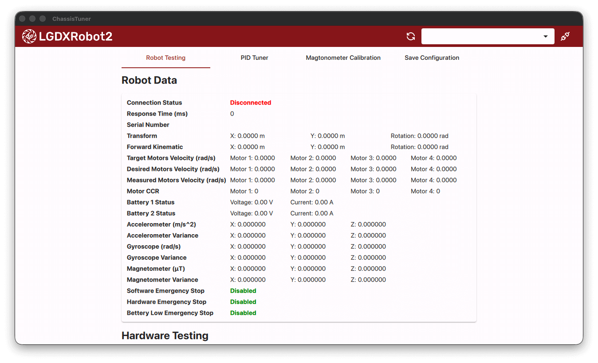
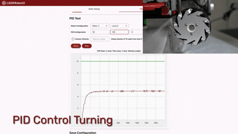

# LGDXRobot2 ChassisTuner




> LGDXRobot2 fully uses GitLab CI/CD for builds.<br />[](https://gitlab.com/lgdxrobotics/lgdxrobot2-chassistuner/-/commits/main) [](https://gitlab.com/lgdxrobotics/lgdxrobot2-chassistuner/-/releases)

LGDXRobot2 ChassisTuner is a GUI tool written in Qt, designed for testing and fine-tuning LGDXRobot2 hardware. It allows you to validate your setup and optimise performance.

- [Homepage](https://lgdxrobot.bristolgram.uk/lgdxrobot2/)
- [Documentation](https://docs.lgdxrobot.bristolgram.uk/lgdxrobot2/)
- LGDXRobot2 Design: ([GitLab](https://gitlab.com/lgdxrobotics/lgdxrobot2-design) | [GitHub](https://github.com/yukaitung/lgdxrobot2-design))
- LGDXRobot2 MCU: ([GitLab](https://gitlab.com/lgdxrobotics/lgdxrobot2-mcu) | [GitHub](https://github.com/yukaitung/lgdxrobot2-mcu))
- LGDXRobot2 ChassisTuner: ([GitLab](https://gitlab.com/lgdxrobotics/lgdxrobot2-chassistuner) | [GitHub](https://github.com/yukaitung/lgdxrobot2-chassistuner))
- LGDXRobot2 ROS2: ([GitLab](https://gitlab.com/lgdxrobotics/lgdxrobot2-ros2) | [GitHub](https://github.com/yukaitung/lgdxrobot2-ros2))

## Features

* Test the communication between the robot and the PC.
* Fine-tune the PID parameters for the motors using a graph.

## Installation

The following instructions assume that you are using Ubuntu 24.04.

1. Install the following packages:

```bash
sudo apt install libxkbcommon-x11-0 libxcb-cursor0 libxcb-icccm4 libxcb-keysyms1
```

2. Download the binary from the [Releases](https://gitlab.com/lgdxrobotics/lgdxrobot2-chassistuner/-/releases) page.
3. Extract the downloaded archive.
4. Launch the program from `bin/ChassisTuner`.


## Compling

1. Download the [Qt Installer](https://www.qt.io/download-qt-installer) and install the following packages:

* Qt 6.10
* Qt Serial Port
* Qt Graphs

2. Clone the [lgdxrobot2-chassistuner](https://gitlab.com/yukaitung/lgdxrobot2-chassistuner) repository.
3. Open the project in Qt Creator.
4. Press **Run** to build and launch the application.